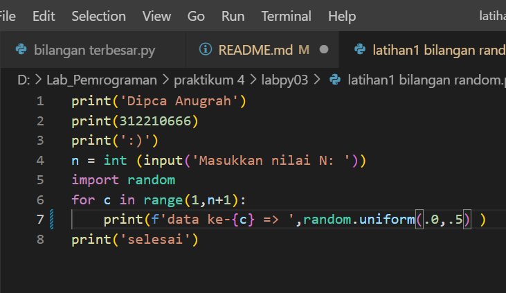
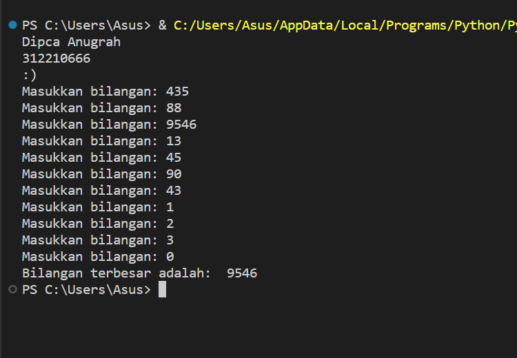

# **labspy02**
**Dipca Anugrah**
**312210666**
# langkah pembuatan program menginput 3 bilangan dan mencari nilai terbesar dari bilangan tersebut
1. Buatlah program untuk menginputkan 3 buah bilangan bertipe data integer atau bilangan bulat:
bilangan 1, bilangan 2, dan bilangan 3 dengan menggunakan variabel a,b dan c.
variabel a bertipe integer (input("Masukkan bilangan ke-1: "))
variabel b bertipe integer (input("Masukkan bilangan ke-2: "))
variabel c bertipe   int (input("Masukkan bilangan ke-3: "))
2. lalu buat statment if untuk mencari bilangan terbesar dari 3 bilangan yang di inputkan tersebut dengan cara:
 - jika bilangan a lebih besar dari bilangan b dan c , maka variabel d (variabel untuk menyimpan 
 bilangan terbesar) adalah variabel a, tetapi
 - jika bilangan a lebih kecil dari bilangan b dan c , maka varibel d adalah variabel b, tetapi 
 - jika bilangan c lebih besar dari bilangan b maka varibel d = variabel c
3. menampilkan bilangan terbesarnya dengan cara memanggil variabel d :
jadi bilangan terbesar nya adalah variabel d

# 
- flowchart programnya

- .png)

# 
- cara dan hasil dari programnya adalah :

- 

1. kondisi 1

- 

2. kondisi 2

- 

3. kondisi 3

- 

# Algoritma Latihan1(input 2 buah bilangan dan mencari nilai terbesarnya)
1. Input bilangan pada variabel a 
2. Input bilangan pada variabel b
3. Gunakan statment if untuk mencari nilai terbesarnya caranya:
- jika bilangan pada variabel a lebih besar dari bilangan pada variabel b maka output nilai terbesar adalah variabel a
- tetapi jika bilangan pada variabel b lebih besar dari bilangan pada bariabel a maka output nilai terbesar adalah variabel b
#
- Kode programnya ebagai berikut:

- 
#
- Hasil kode programnya :

- 

# Algoritma Mengurutkan bilagan dari urutan terkecil
1. Input banyaknya suatu bilagan pada variabel a
2. deklarasi variabel bil dengan array berindeks kosong
3. buat perulangan for untuk menginput nilai atau index pada variabel bil, gunakan variabel x untuk menginputkan nilai nya
4. Gunakan perintah bil.append(x) yang berfungsi untuk memasukkan nilai pada variabel x ke dalam index bil
5. Gunakan perintah list.sort(bil) utnuk mengurutkan bilangan 
#
- Kode programnya sebagai berikut:

- 
#
- Hasil kode pogramnya :

-
# ========================================

# **labpy03**
# Algoritma latihan1(**Bilangan random**)
1. Input variabel n 
2. Import random menggunakan perintah import random
3. Membuat perulangan for untuk mengulangi outputan random sebanyak inputan nilai N
# 
- Kode programnya sebagai berikut:

- 
#
- Hasil kode programnya :

- 

# Algorirma latihan1(**Nested**)
1. Membuat perulangan nested yakni perulangan dalam perulangan, menggunakan perulangan for 
2. Buat perulangan for pertama dan kedua dengan range(10)
3. didalam perulangan tersebut terdapat variabel di sini saya menggunakan variabel i dan b,
4. Gunakan statment if untuk mengatur jarak spasi antar perulangannya supaya terlihat rapi dan membentuk
pola persegi, dengan cara :
- Jika i + b lebih kecil dari 10 maka jarak hanya dua spasi, tetapi
= Jika i + b lebih kecil dari 20 maka jarak hanya satu spasi.
5. lalu print menggunakan end=jarak itu adalah perintah print yang berfungsi membuat perulangan ke samping dan di ikuti juga selanjutnya dengan perintah print(). lebih jelasnya lihat program di bawah ini:

- 
#
- Hasil programnya :

- 
# algoritma latihan2(**Mencari Nilai terbesar**)
1. Mendeklarasikan variabel a sebagai array berindex kosong
2. Membuat perulangan menggunakan while, perulangan akan terus berlanjut selagi bilangan atau index yang di input
tidak sama dengan 0 (!=) dan perulangan akan berhenti jika bilangan atau index yang di inputkan sama dengan 0
3. Membuat variabel d untuk menampung index dalam array variabel a
4. Gunakan perintah variabel_index.append(variabel_penginput) untuk memasukkan nilai yang di inputkan kedalam
index array variabel a
5. Gunakan perintah max() untuk mencari nilai terbesarnya
#
- Kode programnya sebagai berikut:

- 
#
- Hasil kode programnya:

- 

# Algoritma program1
1. Mendeklarasikan varibel :
Modal = 100000000
Laba ke-1 sampai 2 = modal x 0
Laba ke-3 sampai 4 = modal x 0.01
Laba ke-5 sampai 7 = modal x 0.05
Laba ke-8 = modal x 0.03
2. Mendeklarasikan varibel total untuk menambilkan total hasil dari seluruh laba 1 sampai 8
Total = laba ke-1 sampai 2 + laba ke-3 sampai 4 + laba ke-5 sampai 7 + laba ke-8
3. Membuat perulangan menggunakan for untuk menambilkan hasil Laba 1 sampai 8
#
- Kode programnya sebagai berikut:

- 
#
- Hasil kode programnya:

- 
